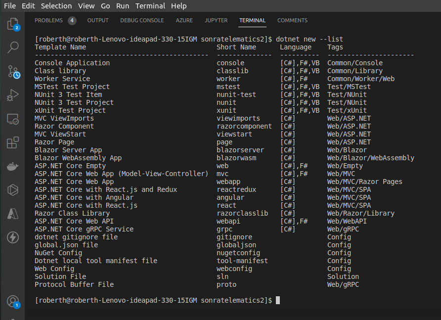

# FullStack Working with MySql, NestJs, Typescript, Graphql, Grpc, C# .NetCore

## Introduction:

Here you will can find two exercises to build backends:

1) The first use NestJs, Typescript, MySql and Graphql to build a API.

2) The second, we testing Grpc tecnology using C# and .NetCore 5.0

## Requeriments to the first app:

### NodeJS principal packets

#### <li> NestJs</li>
#### <li> graphql </li>
#### <li> graphql-scalars</li>
#### <li> graphql-tools</li>
#### <li> mysql2</li>
#### <li> apollo-server-express</li>
#### <li> typeorm</li>

## Starting the server

npm run start:dev

</img>

You can see the server working in the localhost port: 4000.

</img>

This app, it connect to mysql data base and expose the data through a single point of access call
graphql.

"The GraphQL is a query language for APIs. GraphQL provides a complete and understandable description of the data in your API, gives clients the power to ask for exactly what they need and nothing more, makes it easier to evolve APIs over time, and enables powerful developer tools.
(Taken from https://graphql.org/)

With this in mind, we can consult our data, in this case vehicles data base. But before consult anything, we must create the data:

1) First create a vehicle:

</img>
 

As you can see we had created a vehicle and our API have a response inmmedialty and show the data create. Let's see what happen in the mysql data base. 

The file `data-source.ts` contained the function to connect our app with the DB. There are two parameters: `synchronize` and `loggin`, inside this function with the value in `true`, That mean our app go to stablish communication with our DB inmediatly when it run up.

All this is thanks to the pack `tyorm` that create the new table and data in our DB. Letś take a look to our DB:

</img>
 
</img>
 

If we make a `SELECT * from vehicles` you can see the vehicle that we recently created.

</img>
 

Now we can make a GET method to obtain all vehicles. (The query method).

</img>

Or we can GET vehicles by Id. For example Id 7.

</img>

You can see the field codigo. this is a special type of data in graphql is a custom datascalar uuid alphanumerical the 4 length character long.

Other example, we can get a list if all process.

</img>

The same for process by Id. For example id 2.

</img>

And we can build much more with this query lanague for your API.

## Requeriments to the Second app:

<li>.NetCore 5.0</li>
<li>Grcp Server</li>
<li>Grcp Client</li>
<li>Grcp Contrat</li>
<li> C# </li>

For this aplication we builded with .NetCore 5.0 sdk. Throught the console we can build a Grpc project in .NetCore 5.0 with the comand: `dotnet new grpc`

</img>

You can see all projects you can build we .NetCore sdk 5.0, with the command: `dotnet new --list`

The framework do it's job and build the scafolding server for us. but we add some folders and files

But what is Grpc? 

In gRPC, a client application can directly call a method on a server application on a different machine as if it were a local object, making it easier for you to create distributed applications and services. As in many RPC systems, gRPC is based around the idea of defining a service, specifying the methods that can be called remotely with their parameters and return types. On the server side, the server implements this interface and runs a gRPC server to handle client calls. On the client side, the client has a stub (referred to as just a client in some languages) that provides the same methods as the server.

</img>
 

gRPC clients and servers can run and talk to each other in a variety of environments - from servers inside Google to your own desktop - and can be written in any of gRPC’s supported languages. So, for example, you can easily create a gRPC server in Java with clients in Go, Python, or Ruby. In addition, the latest Google APIs will have gRPC versions of their interfaces, letting you easily build Google functionality into your applications.

for more info visit offcial site ( https://grpc.io/ )

## Starting the server

`cd Server/`

`dotnet run`

</img>
 

Go to https://localhost:5001 and we can see a message: `Communication with gRPC endpoints must be made through a gRPC client`

</img>
 

So we have to build a Grpc Client.

To do this, we chose a simple console project from the list projects with the command: `dotnet new console`

The framework do the magic and we implement our solutions. 

## Starting the Client

Go to the dir GrpcGreeterClient (or the name you put to you dir in mthis case was: `GrpcGreeterClient`) 

Again: `dotnet run`

</img>
 

And you can see the Client is in communication with the server. In this project we have to services Client the first comes with the template and the second with our exercise vehicles.

</img>
 

You can see the the server response for both services:

</img>
 

This is a project in building yet, so we add more functionality soon!.

See you next!

@Author: Roberth Rondón

